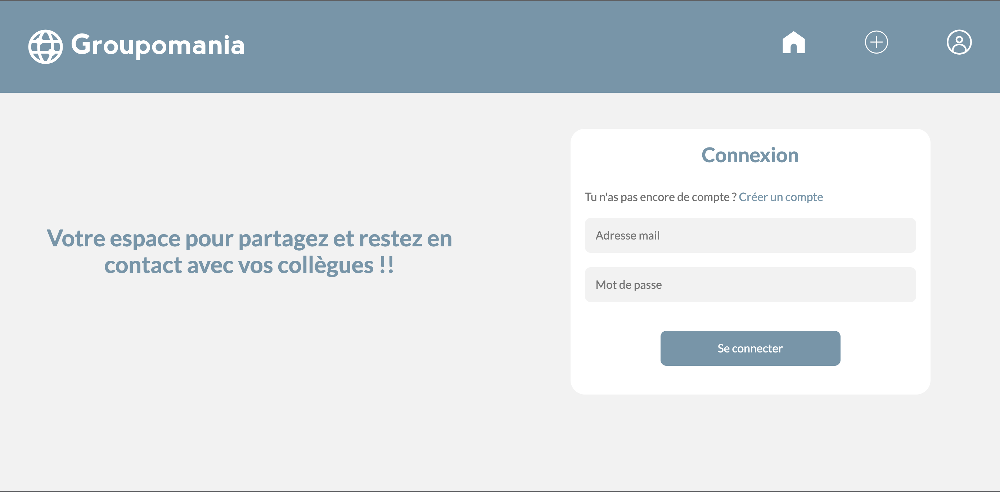

# Groupomania

Bienvenue sur Groupomania Social Network

# SreenShots

## Description

Stack utilisé : Node js et un serveur express pour l'API' / Vue js 3 pour le Front End

1. Veuillez clonez ce repository

# GROUPOMANIA - front (vue 3)

## Installation

Depuis le dossier front : lancer le terminal et lancer le projet, taper la commande suivante `npm install`

## Acceder au serveur (http://localhost:8080/)

Depuis le dossier front : lancer le terminal et accéder au server, taper la commande suivante `npm run serve`

# GROUPOMANIA - api (node js)

## Installer Node

Depuis le dossier api, installer node (si besoin), taper la commande suivante `npm install -g npm`

## Lancer l'api

Dans le dossier api, lancer le terminal et démarrer l'api, taper la commande suivante `npm start`

## Base de données

La base de donnée utliser est mongooDB Altas

1. Crée une base de donnée sur mongooDB atlas
2. Crée un fichier .env dans le dossier api, en ajoutant vos informations de connexion à la base de données (remplacer user Name et password pas vos informations): `MONGODB_USER = User name` `MONGODB_PASSWORD = password `
3. Télécharger mongooDB compass, connectez vous à votre base de donnée mongooDB Atlas, en renseigant dans new connection votre URI `mongodb://[username:password@]host1[:port1][,...hostN[:portN]][/[defaultauthdb][?options]]`
4. Cliquez sur l'onglet collection en haut de votre page mongooDB compass et importer les fichiers de la collection users.json et publication.json

# Utilisation

Pour s'inscrire sur le social network de Groupomania, il vous faut renseigner :

1. Un pseudo
2. Une adresse mail valide
3. Un mot de passe

Une fois connecté vous pouvez voir les publications des utilisateurs et publier:

1. Une description + une image

Ces publications peuvent être likées, commentées, modifiées, supprimées. Le modérateur peut les modifier et les supprimer.
